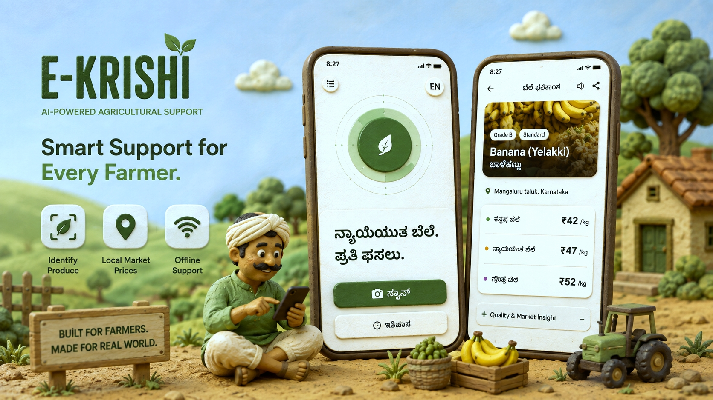

# E-Krishi  

E-Krishi is an AI-powered agricultural support mobile application designed to help farmers identify their produce and understand localized market prices. The application combines on-device image recognition, GPS-based location services, market price estimation, and offline caching to remain useful in regions with limited connectivity.



The mobile application is built with Flutter and forms one part of a larger agricultural support ecosystem that also includes a farmer marketplace and an AI voice assistant for keypad-phone users.
(*Screenshots shown are from the actual app.*)

## Key Features

- **AI Produce Recognition**
  - Uses an on-device TensorFlow Lite model as the primary produce recognition system.
  - Uses Google Gemini as a fallback when the local model cannot confidently identify the produce.
  - Supports produce image capture through the device camera.

- **Localized Market Pricing**
  - Uses the farmer's location to provide district/state-specific price estimates.
  - Presents minimum, fair, and maximum price ranges.
  - Considers factors such as produce grade, location, season, and market conditions.

- **GPS-Based Location**
  - Detects the farmer's current location using GPS.
  - Uses the location to determine the relevant district and state for price estimation.
  - Supports location-based market data retrieval.

- **Offline Price Caching**
  - Price data is stored locally using Hive.
  - Cached prices can be used when internet connectivity is unavailable.
  - Price data is synchronized when connectivity is available.
  - This is particularly important for farmers operating in low-connectivity regions.

- **Bilingual Interface**
  - Supports English and Kannada.
  - Produce names, pricing information, and key interface elements can be presented in Kannada.

- **Scan History**
  - Stores previous produce scans locally.
  - Allows farmers to review previously identified produce and price estimates.

- **Farmer Marketplace Integration**
  - The application includes integration with the E-Krishi backend for farmer profiles and marketplace listings.
  - Farmers can associate produce information and pricing with marketplace listings.

- **Voice and Accessibility Support**
  - Text-to-speech functionality is included to make important price information accessible.
  - The wider E-Krishi ecosystem also includes an AI voice assistant designed for users with keypad phones.

## AI and Market Data Architecture

The application uses a layered approach for produce recognition and pricing.

### Produce Recognition

1. The farmer captures or selects an image of the produce.
2. The image is first processed using the bundled TensorFlow Lite model.
3. If the model produces a sufficiently confident result, that result is used directly.
4. If the local model cannot confidently classify the produce and internet connectivity is available, Google Gemini is used as a fallback.
5. The recognized produce is then used to retrieve or estimate relevant market pricing.

### Market Pricing

The intended production architecture uses government mandi/market data, including Agmarknet, as the authoritative market-data source.

At the current stage of the project, **Agmarknet API access has not yet been obtained because of the required legal and approval process**. Therefore, Google Gemini is currently being used as a temporary fallback for market price estimation and synchronization.

Gemini-generated prices are treated as **estimates**, not as authoritative live mandi prices. The application explicitly represents them as price estimates and stores synchronized results locally for offline use.

Once the required Agmarknet access and approvals are available, the pricing layer can be updated to consume the official market data source instead.

## Offline-First Design

E-Krishi is designed with rural connectivity constraints in mind.

Local storage is handled using Hive, with separate storage for:

- Farmer settings and profile data
- Location information
- Scan history
- Cached market prices
- Price synchronization metadata
- Pending transaction/SMS-related data

When a farmer has an internet connection, current price information can be synchronized and stored locally. When connectivity is unavailable, previously synchronized prices can still be displayed.

## Technology Stack

### Mobile Application

- Flutter
- Dart
- TensorFlow Lite
- Google Gemini API
- Hive / Hive Flutter
- Geolocator
- Camera
- Image Picker
- Connectivity Plus
- Provider
- Flutter TTS
- Permission Handler
- Flutter Local Notifications

### Backend

- Node.js
- Express
- PostgreSQL
- Vercel

The backend provides APIs for farmer information, marketplace listings, transaction-related data, and SMS/payment logging.

## Project Structure

```text
EKrishi/
├── android/                 # Android platform configuration
├── ios/                     # iOS platform configuration
├── assets/
│   └── ml/
│       ├── crop_model.tflite
│       └── crop_labels.txt
├── backend/
│   ├── api/                 # API entry points
│   └── src/
│       ├── db.js
│       └── routes/
├── lib/
│   ├── constants/
│   ├── models/
│   ├── screens/
│   ├── services/
│   └── utils/
├── .env.example
├── pubspec.yaml
└── README.md
```

## Getting Started

### Prerequisites

Install:

- Flutter SDK
- Dart SDK compatible with the version specified in `pubspec.yaml`
- Android Studio or Xcode
- A physical device or emulator
- Node.js and npm if running the backend locally

### 1. Clone the Repository

```bash
git clone https://github.com/aadvt/EKrishi.git
cd EKrishi
```

### 2. Install Flutter Dependencies

```bash
flutter pub get
```

### 3. Configure Environment Variables

Create a `.env` file in the project root based on `.env.example`.

Example:

```env
GEMINI_API_KEY=your_gemini_api_key
AGMARKNET_API_KEY=your_agmarknet_api_key
GOOGLE_MAPS_API_KEY=your_google_maps_api_key
NEON_API_URL=your_backend_url
```

> Note: Agmarknet access is currently pending the required approval/legal process. The application therefore uses Gemini for the current market-price estimation flow.

### 4. Run the Application

Connect a device or start an emulator and run:

```bash
flutter run
```

## Backend Setup

The backend is located in the `backend/` directory.

```bash
cd backend
npm install
```

Create the backend environment file:

```bash
cp .env.example .env
```

Configure the database connection and start the server:

```bash
node --env-file=.env api/index.js
```

The local backend runs on port `3000` by default.

For an Android emulator, the Flutter application can connect to the local backend using:

```env
NEON_API_URL=http://10.0.2.2:3000
```

For a physical device, use the host machine's local network IP.

## API and Data Sources

### Google Gemini

Gemini is currently used for:

- Fallback produce identification
- Produce condition and grade assessment
- Market price estimation
- Price reasoning based on location and season
- Price synchronization while official market API access is unavailable

### Agmarknet

Agmarknet is the intended official market-data source for mandi prices.

**Current status:** Agmarknet API access has not yet been obtained due to the required legal/approval process. Gemini is therefore being used as a temporary fallback for price estimation.

The architecture is designed so that the pricing service can be switched to official Agmarknet data once access is approved.

## Price Estimation

The application presents three primary price values:

- **Minimum Price**
- **Fair Price**
- **Maximum Price**

For Gemini-based estimates, the application considers factors including:

- Produce type
- Produce quality/grade
- District and state
- Current season
- Typical wholesale market conditions

The displayed value should be interpreted as an estimated wholesale/farmer selling price rather than a guaranteed transaction price.

## Project Ecosystem

E-Krishi was developed as part of a larger agricultural technology ecosystem consisting of:

### E-Krishi Mobile Application

The farmer-facing application described in this repository, focused on produce recognition, localized pricing, offline support, and farmer services.

### Farmer Marketplace

A marketplace component designed to allow farmers to list produce and connect with potential buyers.

### AI Voice Assistant

A voice-based assistant designed to make agricultural information accessible to farmers using keypad phones and limited smartphone capabilities.

Together, these components aim to provide farmers with accessible tools for identifying produce, understanding market conditions, and making better selling decisions.

## Recognition and Pricing Flow

```text
             Farmer
                |
                v
        Capture Produce Image
                |
                v
       On-Device TFLite Model
                |
        +-------+-------+
        |               |
   High Confidence   Low/No Confidence
        |               |
        |               v
        |         Google Gemini
        |               |
        +-------+-------+
                |
                v
        Identified Produce
                |
                v
         GPS / District
                |
                v
       Market Price Service
                |
        +-------+-------+
        |               |
   Cached Price      Online Sync
        |               |
        |         Gemini Estimate
        |               |
        +-------+-------+
                |
                v
       Min / Fair / Max Price
                |
                v
              Farmer
```

## Hackathon Recognition

E-Krishi was selected as a **finalist at the National Agriculture Hackathon in Bengaluru**, recognizing the project's approach to applying AI and accessible digital tools to agricultural decision-making.

## Future Improvements

- Replace Gemini-based market estimates with official Agmarknet data once API access is approved.
- Expand the on-device produce recognition model.
- Improve fully offline produce recognition and pricing capabilities.
- Add historical market-price charts and trend analysis.
- Expand Kannada and regional-language support.
- Improve voice-based interaction for farmers.
- Integrate deeper marketplace and transaction workflows.

## License

This project is licensed under the MIT License. See the `LICENSE` file for details.
